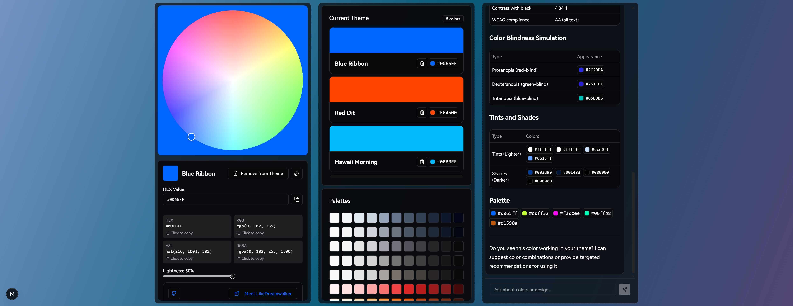
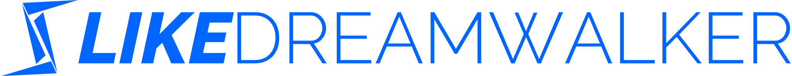

# Mirrorlake Color Agent

An aggregated color agent with LLM, engineering, and other AI capabilities.



## Getting Started

### Online

Visit [mirrorlake.ldwid.com](https://mirrorlake.ldwid.com).

> _The online version is hosted on Vercel and uses my own DeepSeek API key._
>
> _The online version and the original project won't save your data on the server side._

### Local

> **This project is designed to deploy on Vercel.**
>
> If you want to deploy on other services (including your own server), you should extract the Python part to an independent service.
>
> _Before you get started, please make sure you have Python 3.12+ in your local environment_

1. Clone this repository
2. Run `python3 -m venv venv`
3. Run `source venv/bin/activate` on Mac or `venv\Scripts\activate` on Windows
4. Install dependencies with `pnpm i`
5. Run the development server with `pnpm dev`
6. Open [http://localhost:3000](http://localhost:3000) with your browser to see the app
7. To use the Reasoning Engine, you need to set up the DeepSeek API KEY in the `.env.local` file. We're using AI SDK, so you can change the actual reasoning engine to any provider you prefer.

```bash
DEEPSEEK_API_KEY=your_deepseek_api_key
```

## How to Use

You can pick a color from the color picker and view related basic color information. The agent will also provide advice about this color.

You can also talk to the agent to perform various tasks, such as:

- "Give me a random color"
- "Give me a 'You need a blue sky holiday' theme and add it to my theme"
- "Reset my theme to default"
- "Tell me more about `#0066FF`"

## Annotation

### What is this agent about?

The Color Picker, or the Color Agent idea, comes from my earlier project [Mirrorlake Theme Editor](https://github.com/LikeDreamwalker/mirrorlake-theme-editor), which I used to help myself set up custom themes in Vuetify.

Building on this foundation, I developed Mirrorlake as a complete modern AI agent, aimed at offering a better experience in selecting colors and building themes. It uses AI to replace some traditional UI/UX elements and manual tasks.

> _This project is not designed for commercial use, but rather serves as a best practice template for myself, incorporating multiple capabilities I use today._

### Details

Mirrorlake uses a multi-layered architecture:

- **Client Side Runtime (Next.js Client Side)**: Handles states and responds to user actions immediately
- **Server Side Runtime (Hybrid)**: Controls basic logic and computing, bridging the client side and reasoning engine
  - **Next.js Server Side**: Handles rendering, routing, and API calls; connects to edge services and the reasoning engine
    - Reserved for connecting to databases and fetching specific data
  - **Python Server Side**: Handles complex computing and color analysis jobs; runs on Vercel Edge Services or with Liquid Computing
    - Since Mirrorlake is designed for Vercel deployment, its actual power is limited by Edge Services. It would be more common to build an independent Python server to handle complex computing tasks
- **Reasoning Engine (DeepSeek Online Services)**: Handles complex logic and understands user inputs; uses Tool Calling to execute actions for users on the client side; reserved for bidirectional MCP communication

From a business perspective, we have three service levels:

- Basic color actions are handled by the Next.js Client Side
- Color analysis is performed by the Next.js Server Side and Python Server Side working together
- Specific user needs are addressed by the Reasoning Engine, which coordinates with both server and client sides

By working together, these components allow Mirrorlake to offer a flexible experience with lower costs.

### Thanks to

- **[nextjs-fastapi](https://github.com/digitros/nextjs-fastapi)** for inspiring the project structure, offering a brilliant way to combine Python Runtime and Next.js Runtime in both local and production environments.
- **[colord](https://github.com/omgovich/colord)** for color analysis on Next.js runtime. This is the core of Mirrorlake, saving me significant time in building basic color capabilities.
- **[color-names](https://github.com/meodai/color-names)** for generating color names. We built a server action to fetch specific color names from the Next.js Server Side, avoiding memory costs on the Client Side.

...and all the dependencies this project uses!

## Why This?

I appreciate the AI era, but I believe we often expect too much from reasoning models while neglecting traditional engineering that can accomplish many tasks efficiently. Mirrorlake is designed with this philosophy in mind—we only use AI when truly needed and to improve performance, rather than simply offering users a chat interface to do their work. What's the difference between that and giving users a terminal to command themselves?

An agent, or an app that truly integrates AI with engineering, represents the future of AI applications.

## To Contribute

Feel free to open an issue or a pull request! Mirrorlake has potential for many additional features, such as asking AI to provide information about specific colors, or using AI-generated content to create images or videos based on the current theme. I don't have enough time to implement all these ideas, so if you're interested in this project, you're welcome to contribute.

## License

MIT License and All Rights Reserved.



Meet me at [likedreamwalker.space](https://likedreamwalker.space)
