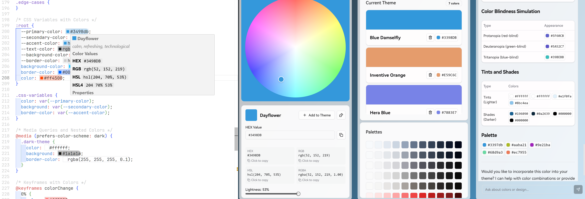
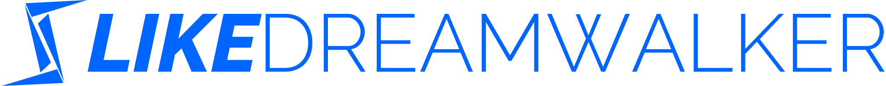

# Mirrorlake Color Agent

An aggregated color agent with LLM, Engineering and the other AI abilities.



## Getting Started

### Online

Visit _[mirrorlake.ldwid.com](https://mirrorlake.ldwid.com)_.

> _The online version is hosted on Vercel and uses my own DeepSeek API key._
>
> _The online version and the original project won't save your data on the server side._

### Local

> **This project is designed to deploy on Vercel.**
>
> If you want to deploy on the other services (including your own server), you should picking up the Python part to an independent service.
>
> _Before you get started, please make sure you have Python 3.12+ on your local env_

1. Clone this repository
2. Run `python3 -m venv venv`
3. Run `source venv/bin/activate` on Mac or `venv\Scripts\activate` on Windows
4. Install dependencies with `pnpm i`
5. Run the development server with `pnpm dev`
6. Open _[http://localhost:3000](http://localhost:3000)_ with your browser to see the app
7. To use the Reasoning Engine, you need to set up the DeepSeek API KEY in `.env.local` file. And we are using AI SDK so you can change the actually reasoning engine to anyone you like.

```bash
   DEEPSEEK_API_KEY=your_deepseek_api_key
```

## How to use

You can pick up a color from the color picker, and you can also see the related basic color information. The agent will try to also return you the advice about this color.

You can also talk to the agent to ask it do the jobs for you as below:

- Give me a random color
- Give me a "You need a blue sky holiday" theme and add it to my theme
- Reset my theme to default
- Tell me more about `#0066FF`

## Annotation

### What is this agent about?

The Color Picker, or the Color Agent idea comes from my early designed project _[Mirrorlake Theme Editior](https://github.com/LikeDreamwalker/mirrorlake-theme-editor)_, which is used to help myself with Vuetify to setup my own theme in time.

Inheriting from this, I built up Mirrorlake today as a Complete Modern AI Agent, which is target at offering a better experience in selecting colors and building up a theme. Also, use AI to replace some of the traditional UI and UX and manually jobs.

> _This project is not designed for commercial, but more like a best practice template for myself, to involve multiple abilities I will use today._

### Details

Mirrorlake uses a different way to work. The main design is as below:

- Client Side Runtime (Next.js Client Side): Handle states and response to User Actions ASAP
- Server Side Runtime (Hybrid): Control the basic logic and ccomputing, also make a bridge between Client Side and Reasoning Engine
  - Next.js Server Side: Handle the rendering, routing and API calls. Connect to the Edge Services and Reasoning Engine
    - Reserved for connecting to DataBase and fetch the specific data
  - Python Server Side: Reserved for handle complex computing and color analysis jobs. Now runs on Vercel Edge Services or with the Liquid Computing
    - Because Mirrolake is designed to deploy on Vercel, the actual power is limited by Edge Services. It should be more common to build up an independent Python Server to handle all the difficult computing jobs
- Reasoning Engine (DeepSeek Online Services): Handle the complex logic and understand the user inputs. Uses Tool Calling to make an action for user on the Client Side. Reserved for bidirectional MCP communication

From a business perspective, now we actually have three levels of services:

- For the basic color actions, the Next.js Client Side is enough to response
- For the color analysis, the Next.js Server Side and Python Server Side will work together to return a universal result
- For the specific user needs, the Reasoning Engine will understand what user needs and tell both the Server and the Client side to finish the job

Since they all working together, Mirrorlake can offer a more flexible experience with lower cost.

### Thanks to

- **_[nextjs-fastapi](https://github.com/digitros/nextjs-fastapi)_** for the inspiration of the project structure, it offers a brilliant way to bind up Python Runtime and Next.js Runtime together both in the local and prod environment.
- **_[colord](https://github.com/omgovich/colord)_** for the color analysis on Next.js runtime. This is actually the core of Mirrorlake, which saved me a lot of time of building up basic color abilities.
- **_[color-names](https://github.com/meodai/color-names)_** for generating color names. And we acually build up a server action to only fetch the specific color name from the NExt.js Server Side, which will avoid the memory cost on Client Side.

... and all the Dependencies this project is using!

## Why this?

I like the times of AI, but I really think we are expecting too much and asking too much from Reasoning and Model, and the traditional engineering is going to be forgotten about it can also do lots of things. And Mirrorlake is designed for this, we only use AI when we actually need and use it to improve our performance, not just offering user an chat input component to do their own jobs. What's the difference between offering user a terminal to command themselves?

Agent, or an app really binding the AI and Engineering together, is the future of AI.

## To contribute

Feel free to open an issue or a pull request! Mirrorlake actually can do lots of things, like asking AI to return items about a specific color, or use AIGC to generate a image or video based on the current theme. But I don't have enough time to do all of these, so if you are interested in this project, you are free to contribute.

## License

MIT License and All Rights Reserved.



Meet Me at _[likedreamwalker.space](https://likedreamwalker.space)_
